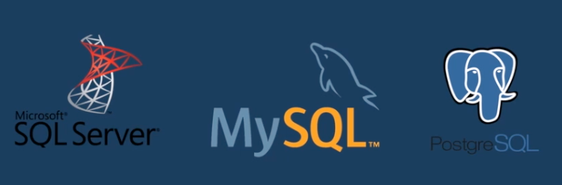

# Introduction to SQL

SQL, Structured Query Language, is a programming language designed to manage data stored in relational databases. SQL operates through simple, declarative statements. This keeps data accurate and secure, and helps maintain the integrity of databases, regardless of size.

The SQL language is widely used today across web frameworks and database applications. Knowing SQL gives you the freedom to explore your data, and the power to make better decisions. By learning SQL, you will also learn concepts that apply to nearly every data storage system.

The statements covered in this course use SQLite Relational Database Management System (RDBMS). You can also access a glossary of all the SQL commands taught in this course.

```sql
 SELECT * FROM celebs
```

The line of code you provided is written in SQL, which is a programming language designed for managing relational databases. Let's break down the syntax and explain its functionality:

**SELECT:** This keyword is used to retrieve data from a database. It specifies that you want to retrieve specific columns or all columns from a table.

**(asterisk):** In SQL, the asterisk (\*) is a wildcard character that represents all columns. When used after the SELECT keyword, it indicates that you want to retrieve all columns from the table.
FROM: This keyword is used to specify the table from which you want to retrieve the data. In this case, the table name is "celebs."

In summary, the line of code **SELECT** FROM celebs" is a SQL query that retrieves all columns from the "celebs" table. It is requesting to retrieve all the data from every column available in the "celebs" table.

MANIPULATION

- Relational Databases
  Nice work! In one line of code, you returned information from a relational database.

SELECT \* FROM celebs;
We’ll take a look at what this code means soon, for now, let’s focus on what relational databases are and how they are organized.

A relational database is a database that organizes information into one or more tables. Here, the relational database contains one table.

A table is a collection of data organized into rows and columns. Tables are sometimes referred to as relations. Here the table is celebs.

A column is a set of data values of a particular type. Here, id, name, and age are the columns.

A row is a single record in a table. The first row in the celebs table has:

- An id of 1
- A name of Justin Bieber
- An age of 22

All data stored in a relational database is of a certain data type. Some of the most common data types are:

- INTEGER, a positive or negative whole number
- TEXT, a text string
- DATE, the date formatted as YYYY-MM-DD
- REAL, a decimal value

Query Results
id name age
1 Justin Bieber 22
2 Beyonce Knowles 33
3 Jeremy Lin 26
4 Taylor Swift 26

Database Schema
celebs
name type
id INTEGER
name TEXT
age INTEGER
Rows: 4

a database management system is used to interact with a db.

there are several dbms programs and myslq is the most popular among them.



SQL is a language designed to manage and communicate with the information stored in the databases of relational data

"Language for Data Definition (LDD)"
"Language for Data Manipulation (LMD)"
"Language for Data Control (LCD)"

A relational database is one where:

All tables have a field that serves as a unique identifier for each record.
This identifier allows predefined relationships between all tables.

In SQL, verbs are used to define and manipulate the structure and data within a database. These verbs are part of Data Definition Language (DDL) and Data Manipulation Language (DML). Here’s an explanation of how SQL applies these verbs and their definitions:

1. CREATE
   Definition: The CREATE verb is used to establish a new database object such as a table, view, index, or stored procedure.

Usage:

Creating a Table:

```sql

CREATE TABLE Employees (
    EmployeeID INT PRIMARY KEY,
    FirstName VARCHAR(50),
    LastName VARCHAR(50),
    HireDate DATE
);
```

This command creates a new table called Employees with four columns: EmployeeID, FirstName, LastName, and HireDate.

Creating a Database:

```sql
CREATE DATABASE CompanyDB;
```

This command creates a new database named CompanyDB.

2. DROP
   Definition: The DROP verb is used to remove an existing database object from the database. This action is irreversible and removes the object and all its data.

Usage:

Dropping a Table:

```sql
DROP TABLE Employees;
```

This command deletes the Employees table and all the data contained within it.

Dropping a Database:

```sql
DROP DATABASE CompanyDB;
```

This command removes the CompanyDB database and all its associated objects.

3. ALTER
   Definition: The ALTER verb is used to modify the structure of an existing database object. It allows you to add, delete, or change columns and constraints in a table.

Usage:

Altering a Table to Add a Column:

```sql

ALTER TABLE Employees
ADD Email VARCHAR(100);

```

This command adds a new column named Email to the Employees table.

Altering a Table to Drop a Column:

```sql
ALTER TABLE Employees
DROP COLUMN Email;
```

This command removes the Email column from the Employees table.

Altering a Table to Modify a Column:

```sql

ALTER TABLE Employees
MODIFY LastName VARCHAR(100);
```

This command changes the LastName column's data type to VARCHAR(100).

Summary:

CREATE: Adds new objects to the database.
DROP: Removes objects from the database.
ALTER: Changes the structure of existing objects.

```

```
