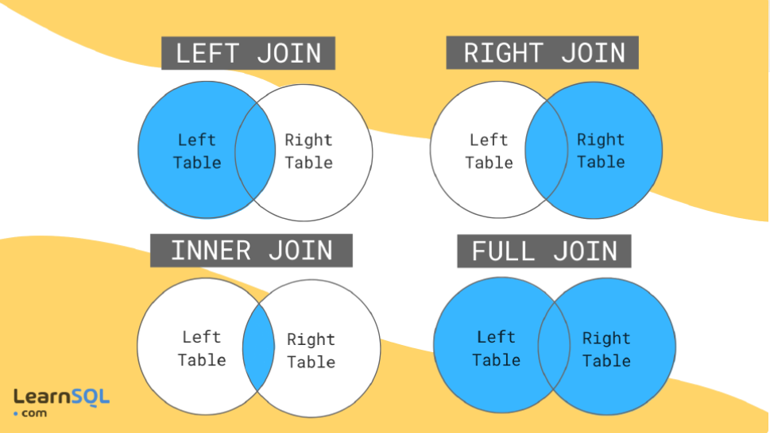

## retrieve all the columns of the table

```sql
SELECT * FROM movies;
```

## retrieve two columns

```sql
SELECT Title, Year FROM movies;
```

```sql
* is too much expensive
```

## Queries with constraints

SQL Lesson 2: Queries with constraints (Pt. 1)
Now we know how to select for specific columns of data from a table, but if you had a table with a hundred million rows of data, reading through all the rows would be inefficient and perhaps even impossible.

In order to filter certain results from being returned, we need to use a WHERE clause in the query. The clause is applied to each row of data by checking specific column values to determine whether it should be included in the results or not.

```sql
Select query with constraints
SELECT column, another_column, …
FROM mytable
WHERE condition
    AND/OR another_condition
    AND/OR …;
```

More complex clauses can be constructed by joining numerous AND or OR logical keywords (ie. num_wheels >= 4 AND doors <= 2). And below are some useful operators that you can use for numerical data (ie. integer or floating point):

```sql
Operator	Condition	SQL Example
=, !=, < <=, >, >=	Standard numerical operators	col_name != 4
BETWEEN … AND …	Number is within range of two values (inclusive)	col_name BETWEEN 1.5 AND 10.5
NOT BETWEEN … AND …	Number is not within range of two values (inclusive)	col_name NOT BETWEEN 1 AND 10
IN (…)	Number exists in a list	col_name IN (2, 4, 6)
NOT IN (…)	Number does not exist in a list	col_name NOT IN (1, 3, 5)
```

In addition to making the results more manageable to understand, writing clauses to constrain the set of rows returned also allows the query to run faster due to the reduction in unnecessary data being returned.

## Did you know?

As you might have noticed by now, SQL doesn't require you to write the keywords all capitalized, but as a convention, it helps people distinguish SQL keywords from column and tables names, and makes the query easier to read.

```sql
Id	Title	Director	Year	Length_minutes
1	Toy Story	John Lasseter	1995	81
2	A Bug's Life	John Lasseter	1998	95
3	Toy Story 2	John Lasseter	1999	93
4	Monsters, Inc.	Pete Docter	2001	92
5	Finding Nemo	Andrew Stanton	2003	107
6	The Incredibles	Brad Bird	2004	116
7	Cars	John Lasseter	2006	117
8	Ratatouille	Brad Bird	2007	115
9	WALL-E	Andrew Stanton	2008	104
10	Up	Pete Docter	2009	101
11	Toy Story 3	Lee Unkrich	2010	103
12	Cars 2	John Lasseter	2011	120
13	Brave	Brenda Chapman	2012	102
14	Monsters University	Dan Scanlon	2013	110
```

## Exercises

- 1. Find the movie with a row id of 6

```sql
SELECT * FROM movies where id = 6;
results:
```

```sql
Id	Title	Director	Year	Length_minutes
6	The Incredibles	Brad Bird	2004	116
```

- 2. Find the movies released in the years between 2000 and 2010

```sql
SELECT * FROM movies where Year BETWEEN 2000 AND 2010;
```

- 3. Find the movies not released in the years between 2000 and 2010

```sql
SELECT * FROM movies where Year NOT BETWEEN 2000 AND 2010;
```

- 4. Find the first 5 Pixar movies and their release year

```sql
SELECT year FROM movies where Id  BETWEEN 1 AND 5;
```

SQL Lesson 3: Queries with constraints (Pt. 2)
When writing WHERE clauses with columns containing text data, SQL supports a number of useful operators to do things like case-insensitive string comparison and wildcard pattern matching. We show a few common text-data specific operators below:

```sql
Operator	Condition	Example
=	Case sensitive exact string comparison (notice the single equals)	col_name = "abc"
!= or <>	Case sensitive exact string inequality comparison	col_name != "abcd"
LIKE	Case insensitive exact string comparison	col_name LIKE "ABC"
NOT LIKE	Case insensitive exact string inequality comparison	col_name NOT LIKE "ABCD"
%	Used anywhere in a string to match a sequence of zero or more characters (only with LIKE or NOT LIKE)	col_name LIKE "%AT%"
(matches "AT", "ATTIC", "CAT" or even "BATS")
_	Used anywhere in a string to match a single character (only with LIKE or NOT LIKE)	col_name LIKE "AN_"
(matches "AND", but not "AN")
IN (…)	String exists in a list	col_name IN ("A", "B", "C")
NOT IN (…)	String does not exist in a list	col_name NOT IN ("D", "E", "F")
```

Exercise 3 — Tasks

1. Find all the Toy Story movies

```SQL
SELECT * FROM movies WHERE title LIKE "%Toy Story%";
```

2. Find all the movies directed by John Lasseter

```SQL
SELECT * FROM movies WHERE director = "John Lasseter";
```

or

```SQL
SELECT * FROM movies WHERE director lIKE = "john lasseter";
```

this operation is more expensive

% es danger find all the director that containing the letter **a**

The more specific the faster, the less specific the slower

```SQL
SELECT * FROM movies WHERE director lIKE = "%a%";
```

3. Find all the movies (and director) not directed by John Lasseter

```sql
SELECT * FROM movies WHERE director != "John Lasseter";
```

4. Find all the WALL-\* movies

```sql
SELECT * FROM movies WHERE title lIKE = "%WALL_%";
```

## match

9 WALL-E Andrew Stanton 2008 104
87 WALL-G Brenda Chapman 2042 97

## Filtering and sorting Query results

Even though the data in a database may be unique, the results of any particular query may not be – take our Movies table for example, many different movies can be released the same year. In such cases, SQL provides a convenient way to discard rows that have a duplicate column value by using the DISTINCT keyword.

```sql
Select query with unique results
SELECT DISTINCT column, another_column, …
FROM mytable
WHERE condition(s);
```

Since the DISTINCT(distincion) keyword will blindly remove duplicate rows, we will learn in a future lesson how to discard duplicates based on specific columns using grouping and the GROUP BY clause.

Ordering results

Unlike our neatly ordered table in the last few lessons, most data in real databases are added in no particular column order. As a result, it can be difficult to read through and understand the results of a query as the size of a table increases to thousands or even millions rows.

To help with this, SQL provides a way to sort your results by a given column in ascending or descending order using the ORDER BY clause.

```sql
Select query with ordered results
SELECT column, another_column, …
FROM mytable
WHERE condition(s)
ORDER BY column ASC/DESC;
```

When an ORDER BY clause is specified, each row is sorted alpha-numerically based on the specified column's value. In some databases, you can also specify a collation to better sort data containing international text.

Limiting results to a subset
Another clause which is commonly used with the ORDER BY clause are the LIMIT and OFFSET clauses, which are a useful optimization to indicate to the database the subset of the results you care about.
The LIMIT will reduce the number of rows to return, and the optional OFFSET will specify where to begin counting the number rows from.

```sql
Select query with limited rows
SELECT column, another_column, …
FROM mytable
WHERE condition(s)
ORDER BY column ASC/DESC
LIMIT num_limit OFFSET num_offset;
```

If you think about websites like Reddit or Pinterest, the front page is a list of links sorted by popularity and time, and each subsequent page can be represented by sets of links at different offsets in the database. Using these clauses, the database can then execute queries faster and more efficiently by processing and returning only the requested content.

Did you know?
If you are curious about when the LIMIT and OFFSET are applied relative to the other parts of a query, they are generally done last after the other clauses have been applied. We'll touch more on this in Lesson 12: Order of execution after introducting a few more parts of the query.

ORDER BY -> Order alphabetically
DISTINCT -> I want the directo without duplicate

1. List all directors of Pixar movies (alphabetically), without duplicates ✓

```sql
SELECT DISTINCT director FROM movies ORDER BY director;
```

2. List the last four Pixar movies released (ordered from most recent to least)

```sql
SELECT * FROM movies ORDER BY year DESC LIMIT 4;
```

3. List the first five Pixar movies sorted alphabetically

```sql
SELECT * FROM movies ORDER BY title ASC LIMIT 5;
```

List the next five Pixar movies sorted alphabetically

```sql
SELECT * FROM movies ORDER BY title ASC LIMIT 5 OFFSET 5;
```

## Simple SELECT Queries

You've done a good job getting to this point! Now that you've gotten a taste of how to write a basic query, you need to practice writing queries that solve actual problems.

```sql
SELECT query
SELECT column, another_column, …
FROM mytable
WHERE condition(s)
ORDER BY column ASC/DESC
LIMIT num_limit OFFSET num_offset;
```

Exercise

In the exercise below, you will be working with a different table. This table instead contains information about a few of the most populous cities of North America[1] including their population and geo-spatial location in the world.

## Did you know?

Positive latitudes correspond to the northern hemisphere, and positive longitudes correspond to the eastern hemisphere. Since North America is north of the equator and west of the prime meridian, all of the cities in the list have positive latitudes and negative longitudes.

Try and write some queries to find the information requested in the tasks you know. You may have to use a different combination of clauses in your query for each task. Once you're done, continue onto the next lesson to learn about queries that span multiple tables.

1. List all the Canadian cities and their populations

```sql
SELECT * FROM north_american_cities WHERE Country = "Canada";
```

2. Order all the cities in the United States by their latitude from north to south

```sql
SELECT * FROM north_american_cities
WHERE longitude < 87.68
ORDER BY longitude ASC;
```

3. List all the cities west of Chicago, ordered from west to east

```sql
SELECT * FROM north_american_cities
WHERE longitude < -87.629798
ORDER BY longitude ASC;
```

4. List the two largest cities in Mexico (by population)

```sql
SELECT * FROM north_american_cities
WHERE country = "Mexico"
ORDER BY population DESC
LIMIT 2;
```

5 List the third and fourth largest cities (by population) in the United States and their population

```sql
SELECT * FROM north_american_cities
WHERE country = "United States"
ORDER BY population DESC
LIMIT 2
OFFSET 2;
```

## Multi-table queries with JOINs

When we realize the relation between two tables, we want to retrieve data from a table and be able to take it to another

We want to make the realtion, we have the user table and the tweets table, we want to bring us the information to be able to make an introinspetion of the data and to be able to make a match, than to have the data of all these tables and not to have them separated.
There are different types of joins:

**INNER JOIN:** This type of join returns only records that have matches in both tables based on the specified condition. Records that do not meet the condition will not be included in the result.

**INNER JOIN: MATCH**

**LEFT JOIN (LEFT OUTER JOIN):** A left join returns all records from the left table (the first mentioned table) and matching records from the right table (the second mentioned table). If there are no matches in the right table, the values will be null.

**RIGHT JOIN (RIGHT OUTER JOIN):** Similar to the left join, but returns all records in the right table and the matching records in the left table. If there are no matches in the left table, the values will be null.

**FULL JOIN (FULL OUTER JOIN):** A full join returns all records from both tables, with matches where they exist and null values where there are no matches.

SELF JOIN: This type of join is used when you want to combine a table with itself. Aliases are used to distinguish the two instances of the same table.

**CROSS JOIN (CARTESIAN JOIN):** A cross join combines all the rows of a table with all the rows of another table, generating a Cartesian product. It is important to be careful when using cross joins, as they can generate a large number of results.



## Multi-table queries with

Up to now, we've been working with a single table, but entity data in the real world is often broken down into pieces and stored across multiple orthogonal tables using a process known as normalization[1].

## Database normalization

Database normalization is useful because it minimizes duplicate data in any single table, and allows for data in the database to grow independently of each other (ie. Types of car engines can grow independent of each type of car). As a trade-off, queries get slightly more complex since they have to be able to find data from different parts of the database, and performance issues can arise when working with many large tables.

In order to answer questions about an entity that has data spanning multiple tables in a normalized database, we need to learn how to write a query that can combine all that data and pull out exactly the information we need.

## Multi-table queries with JOINs

Tables that share information about a single entity need to have a primary key that identifies that entity uniquely across the database. One common primary key type is an auto-incrementing integer (because they are space efficient), but it can also be a string, hashed value, so long as it is unique.

Using the JOIN clause in a query, we can combine row data across two separate tables using this unique key. The first of the joins that we will introduce is the INNER JOIN.

```sql
Select query with INNER JOIN on multiple tables
SELECT column, another_table_column, …
FROM mytable
INNER JOIN another_table
    ON mytable.id = another_table.id
WHERE condition(s)
ORDER BY column, … ASC/DESC
LIMIT num_limit OFFSET num_offset;
```

The INNER JOIN is a process that matches rows from the first table and the second table which have the same key (as defined by the ON constraint) to create a result row with the combined columns from both tables. After the tables are joined, the other clauses we learned previously are then applied.

Did you know?
You might see queries where the INNER JOIN is written simply as a JOIN. These two are equivalent, but we will continue to refer to these joins as inner-joins because they make the query easier to read once you start using other types of joins, which will be introduced in the following lesson.

Exercise
We've added a new table to the Pixar database so that you can try practicing some joins. The BoxOffice table stores information about the ratings and sales of each particular Pixar movie, and the Movie_id column in that table corresponds with the Id column in the Movies table 1-to-1. Try and solve the tasks below using the INNER JOIN introduced above.

Table: Movies (Read-Only)
Id Title Director Year Length_minutes
1 Toy Story John Lasseter 1995 81
2 A Bug's Life John Lasseter 1998 95
3 Toy Story 2 John Lasseter 1999 93
4 Monsters, Inc. Pete Docter 2001 92
5 Finding Nemo Andrew Stanton 2003 107
6 The Incredibles Brad Bird 2004 116
7 Cars John Lasseter 2006 117
8 Ratatouille Brad Bird 2007 115
9 WALL-E Andrew Stanton 2008 104
10 Up Pete Docter 2009 101
11 Toy Story 3 Lee Unkrich 2010 103
12 Cars 2 John Lasseter 2011 120
13 Brave Brenda Chapman 2012 102
14 Monsters University Dan Scanlon 2013 110

Table: Boxoffice (Read-Only)
Movie_id Rating Domestic_sales International_sales
5 8.2 380843261 555900000
14 7.4 268492764 475066843
8 8 206445654 417277164
12 6.4 191452396 368400000
3 7.9 245852179 239163000
6 8 261441092 370001000
9 8.5 223808164 297503696
11 8.4 415004880 648167031
1 8.3 191796233 170162503
7 7.2 244082982 217900167
10 8.3 293004164 438338580
4 8.1 289916256 272900000
2 7.2 162798565 200600000
13 7.2 237283207 301700000

Exercise

1. Find the domestic and international sales for each movie

```sql
SELECT title, Domestic_sales, International_sales
FROM movies
INNER JOIN Boxoffice on id = movie_id;
```

2. Show the sales numbers for each movie that did better internationally rather than domestically

```sql
SELECT title, Domestic_sales, International_sales
FROM movies
INNER JOIN Boxoffice on id = movie_id
WHERE International_sales > Domestic_sales;
```

3. List all the movies by their ratings in descending order

```sql
SELECT title, Domestic_sales, International_sales
FROM movies
INNER JOIN Boxoffice on id = movie_id
ORDER BY rating DESC;
```

join can be concatenated

## OUTER JOINs

Depending on how you want to analyze the data, the INNER JOIN we used last lesson might not be sufficient because the resulting table only contains data that belongs in both of the tables.

If the two tables have asymmetric data, which can easily happen when data is entered in different stages, then we would have to use a LEFT JOIN, RIGHT JOIN or FULL JOIN instead to ensure that the data you need is not left out of the results.

```sql
Select query with LEFT/RIGHT/FULL JOINs on multiple tables
SELECT column, another_column, …
FROM mytable
INNER/LEFT/RIGHT/FULL JOIN another_table
    ON mytable.id = another_table.matching_id
WHERE condition(s)
ORDER BY column, … ASC/DESC
LIMIT num_limit OFFSET num_offset;
```

Like the INNER JOIN these three new joins have to specify which column to join the data on.
When joining table A to table B, a LEFT JOIN simply includes rows from A regardless of whether a matching row is found in B. The RIGHT JOIN is the same, but reversed, keeping rows in B regardless of whether a match is found in A. Finally, a FULL JOIN simply means that rows from both tables are kept, regardless of whether a matching row exists in the other table.

When using any of these new joins, you will likely have to write additional logic to deal with NULLs in the result and constraints (more on this in the next lesson).

Did you know?
You might see queries with these joins written as LEFT OUTER JOIN, RIGHT OUTER JOIN, or FULL OUTER JOIN, but the OUTER keyword is really kept for SQL-92 compatibility and these queries are simply equivalent to LEFT JOIN, RIGHT JOIN, and FULL JOIN respectively.

Exercise

In this exercise, you are going to be working with a new table which stores fictional data about Employees in the film studio and their assigned office Buildings. Some of the buildings are new, so they don't have any employees in them yet, but we need to find some information about them regardless.

Since our browser SQL database is somewhat limited, only the LEFT JOIN is supported in the exercise below.

Table: Buildings (Read-Only)
Building_name Capacity
1e 24
1w 32
2e 16
2w 20

Table: Employees (Read-Only)
Role Name Building Years_employed
Engineer Becky A. 1e 4
Engineer Dan B. 1e 2
Engineer Sharon F. 1e 6
Engineer Dan M. 1e 4
Engineer Malcom S. 1e 1
Artist Tylar S. 2w 2
Artist Sherman D. 2w 8
Artist Jakob J. 2w 6
Artist Lillia A. 2w 7
Artist Brandon J. 2w 7
Manager Scott K. 1e 9
Manager Shirlee M. 1e 3
Manager Daria O. 2w 6

1. Find the list of all buildings that have employees

```sql
SELECT DISTINCT Building FROM employees;
```

```sql
SELECT DISTINCT Building_name FROM buildings
LEFT JOIN employees ON building_name = building
WHERE ROLE IS NOT NULL;
```

2 Find the list of all buildings and their capacity

```sql
SELECT DISTINCT Building_name, capacity FROM buildings
LEFT JOIN employees ON building_name = building
```

3. List all buildings and the distinct employee roles in each building (including empty buildings)

```sql
SELECT DISTINCT Building_name, role FROM buildings
LEFT JOIN employees ON Building_name = Building

```

In SQL, the DISTINCT clause is used to filter the results of a query so that only unique values in a specific column are displayed. When the DISTINCT keyword is applied to a query, the database engine removes duplicate rows based on the values in the specified column, and only displays one instance of each unique value in that column.

The basic syntax for using DISTINCT in an SQL query is as follows:

sql
Copy code
SELECT DISTINCT column FROM table;

## A short note on NULLs

As promised in the last lesson, we are going to quickly talk about NULL values in an SQL database. It's always good to reduce the possibility of NULL values in databases because they require special attention when constructing queries, constraints (certain functions behave differently with null values) and when processing the results.

An alternative to NULL values in your database is to have data-type appropriate default values, like 0 for numerical data, empty strings for text data, etc. But if your database needs to store incomplete data, then NULL values can be appropriate if the default values will skew later analysis (for example, when taking averages of numerical data).

Sometimes, it's also not possible to avoid NULL values, as we saw in the last lesson when outer-joining two tables with asymmetric data. In these cases, you can test a column for NULL values in a WHERE clause by using either the IS NULL or IS NOT NULL constraint.

```SQL
Select query with constraints on NULL values
SELECT column, another_column, …
FROM mytable
WHERE column IS/IS NOT NULL
AND/OR another_condition
AND/OR …;
```

Exercise
This exercise will be a sort of review of the last few lessons. We're using the same Employees and Buildings table from the last lesson, but we've hired a few more people, who haven't yet been assigned a building.

Table: Buildings (Read-Only)
Building_name Capacity
1e 24
1w 32
2e 16
2w 20

Table: Employees (Read-Only)
Role Name Building Years_employed
Engineer Becky A. 1e 4
Engineer Dan B. 1e 2
Engineer Sharon F. 1e 6
Engineer Dan M. 1e 4
Engineer Malcom S. 1e 1
Artist Tylar S. 2w 2

1. Find the name and role of all employees who have not been assigned to a building

```sql
SELECT name, role FROM employees
WHERE building is NULL
```

2. Find the names of the buildings that hold no employees

```sql
SELECT building_name from buildings
LEFT JOIN employees ON Building_name = building
WHERE ROLE is NULL
```

on doing the relation is like where of join

LEFT JOIN, also known as LEFT OUTER JOIN, is a type of join operation in SQL that combines rows from two or more tables based on a specified condition while retaining all the rows from the left table (the first mentioned table) and matching rows from the right table (the second mentioned table). If there are no matches in the right table, null values will be shown in those positions.

The basic syntax of a LEFT JOIN is as follows:

```sql
Copy code
SELECT columns
FROM left_table
```

LEFT JOIN right_table ON left_table.column = right_table.column;
Here, "columns" are the columns you want to select in the query, "left_table" is the first table from which you want to select data, "right_table" is the second table, and "column" is the column on which you want to base the join condition.

The result of a LEFT JOIN will include all the rows from the left table and the matching rows from the right table according to the specified join condition. If there are no matches in the right table, those positions will be filled with null values.

For example, suppose you have two tables, "customers" and "orders", and you want to get a list of all customers along with their orders (if they have any):

Table "customers":

diff
Copy code
customer_id | name

---

1 | John
2 | Maria
3 | Carlos
Table "orders":

mathematica
Copy code
order_id | customer_id | product

---

101 | 1 | Product A
102 | 2 | Product B
103 | 1 | Product C
You can use a LEFT JOIN to get a list of customers along with their orders (if they have any):

```sql
Copy code
SELECT customers.name, orders.product
FROM customers
LEFT JOIN orders ON customers.customer_id = orders.customer_id;
```

Result:

mathematica
Copy code
name | product

---

John | Product A
Maria | Product B
John | Product C
Carlos | NULL
In this example, the result includes all rows from the "customers" table and the matching rows from the "orders" table. Since Carlos has no orders, his row displays NULL in the "product" column.
