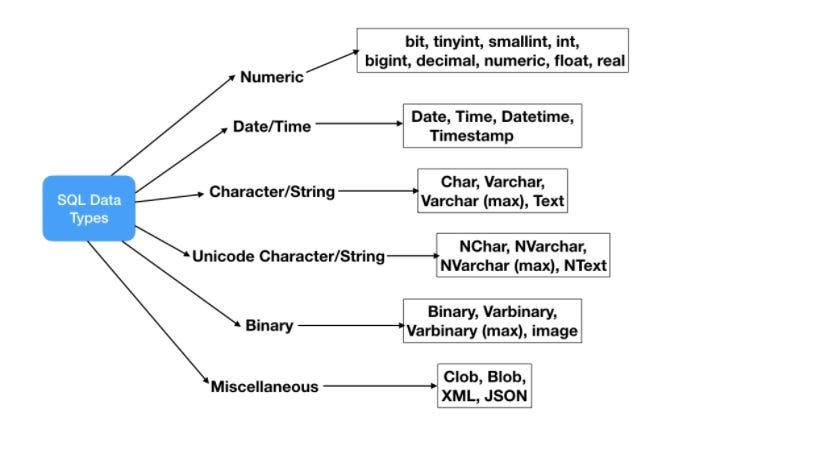
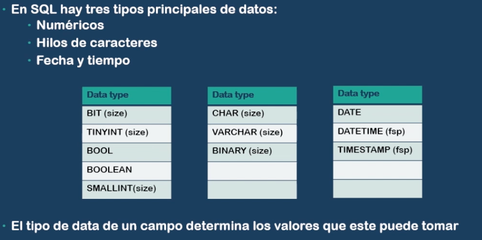

## Data are representations of attributes of facts or elements:

- Measurements
- Identifiers
- Descriptions

## Data can be qualitative or quantitative:

- Qualitative data refer to categories that cannot be measured, such as color and gender.
- Quantitative data are measurements of attributes or variables, such as height, weight, and volumes.





## Primary Key

A primary key (PK) is a unique, non-null identifier that uniquely identifies a row in a database. It also exists to relate rows between different tables. Every table must have a primary key, and primary keys can consist of one or more columns.

## Use Cases for Primary Key:

- Uniqueness: Ensures that each record in a table is unique. For example, in a Users table, the user_id column can be the primary key to uniquely identify each user.
- Indexing: Improves performance for data retrieval operations by creating an index on the primary key column.
- Data Integrity: Helps maintain data integrity by preventing duplicate records.

## Foreign Key

A foreign key (FK) in a table establishes a link to the primary key of another table, meaning it creates a relationship between a column in one table and the primary key of another table.

- The table that contains the foreign key is called the child table.
- The table that contains the primary key is called the parent table.
- It exists to prevent actions that would destroy the relationships between tables by enforcing referential integrity. This is done by prohibiting the insertion of a foreign key value that does not exist in the parent table.

Example

## Creating Tables, create Parent Table with Primary Key

```sql
CREATE TABLE Users (
    user_id INT AUTO_INCREMENT,
    username VARCHAR(50) NOT NULL,
    email VARCHAR(100) NOT NULL,
    PRIMARY KEY (user_id)
);
```

In this example, user_id is the primary key for the Users table. It uniquely identifies each user.

## Create Child Table with Foreign Key

```sql
CREATE TABLE Orders (
order_id INT AUTO_INCREMENT,
user_id INT,
order_date DATE NOT NULL,
total_amount DECIMAL(10, 2) NOT NULL,
PRIMARY KEY (order_id),
FOREIGN KEY (user_id) REFERENCES Users(user_id)
ON DELETE CASCADE
ON UPDATE CASCADE
);
```

In this example:

order_id is the primary key for the Orders table.
user_id is a foreign key that references the user_id column in the Users table.
The foreign key ensures that each user_id in the Orders table must correspond to a user_id in the Users table. The ON DELETE CASCADE clause means that if a user is deleted from the Users table, all associated orders will be automatically deleted as well. The ON UPDATE CASCADE clause means that if the user_id in the Users table is updated, the change will be reflected in the Orders table.

## Inserting Data

```sql

-- Insert data into the Users table
INSERT INTO Users (username, email) VALUES ('john_doe', 'john@example.com');
INSERT INTO Users (username, email) VALUES ('jane_smith', 'jane@example.com');

-- Insert data into the Orders table
INSERT INTO Orders (user_id, order_date, total_amount) VALUES (1, '2024-08-08', 100.50);
INSERT INTO Orders (user_id, order_date, total_amount) VALUES (2, '2024-08-08', 150.75);
Querying Data
To get all orders with user details, you can use a JOIN query:
```

```sql
SELECT Orders.order_id, Users.username, Orders.order_date, Orders.total_amount
FROM Orders
JOIN Users ON Orders.user_id = Users.user_id;
```

This query retrieves all orders along with the corresponding user information.
